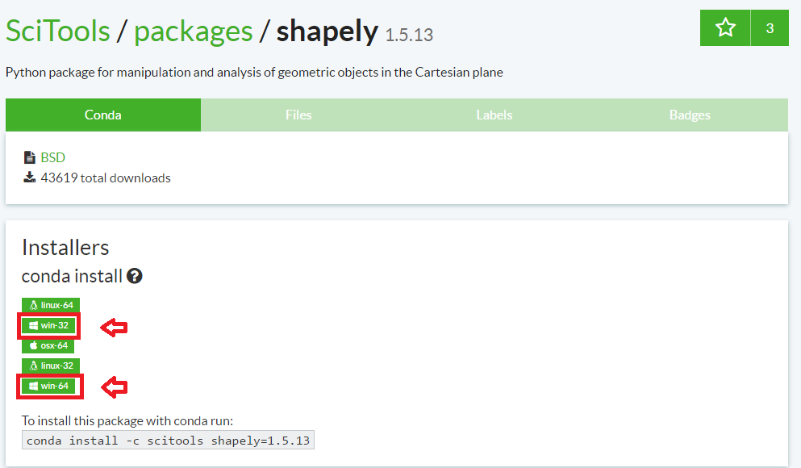
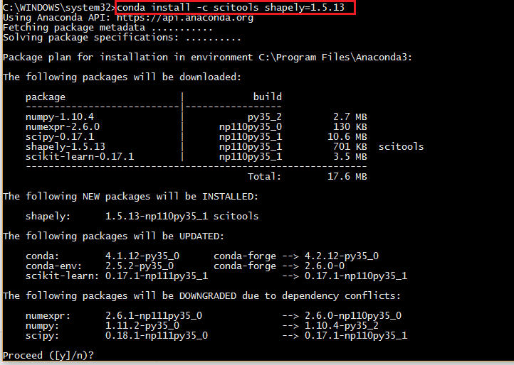

# Installing Python

**It is possible to do programming with Python on your own computer**,
but first you need to install Python. The purpose of this page is to
help you to install Python and different Python packages into your own
computer. Even though it is possible to install Python from their
[homepage](https://www.python.org/), **we highly recommend using**
[Anaconda](https://www.anaconda.com/download/) which is an open source
distribution of the Python and R programming languages for large-scale
data processing, predictive analytics, and scientific computing, that
aims to simplify package management and deployment. In short, it makes
life much easier when installing new tools to your Python.

## Install Python on Windows

For people working with computers from University of Helsinki: A recent
version of Anaconda should be available from the [University of Helsinki
Software
Center](https://helpdesk.it.helsinki.fi/en/instructions/computer-and-printing/software/software-center).

Following steps have been tested to work on Windows 7 and 10 with
Anaconda3 version 5.2.0 (June 2018) that installs Python 3.6 and various
useful packages.

[Download Anaconda installer (64
bit)](https://repo.anaconda.com/archive/Anaconda3-5.2.0-Windows-x86_64.exe)
for Windows.

Install Anaconda to your computer by double clicking the installer and
install it into a directory you want (needs admin rights). Install it to
**all users** and use default settings.

:::: note
::: title
Note
:::

Note for Windows users with a **computer administered by the University
of Helsinki**: If you don\'t have administrator rights on your computer,
you might want to apply for an admin account. Read more about
administrator rights and software installations in
[here](https://helpdesk.it.helsinki.fi/en/instructions/computer-and-printing/workstation-administrator-rights)
::::

Test that the Anaconda´s package manage called `conda` works by [opening
a command prompt as a admin
user](http://www.howtogeek.com/194041/how-to-open-the-command-prompt-as-administrator-in-windows-8.1/)
and running command `conda --version`. If the command returns a version
number of conda (e.g. `conda 4.5.9`) everything is working correctly.

## Install Python on macOS

There is now a convenient graphical installer that can be used to
install Anaconda for Mac. For the IntroQG people, we recommend you
install Anaconda 4.4.0 by visiting [the Anaconda downloads
page](https://www.anaconda.com/download/#macos) and clicking on the
button to install the latest Python 3 version of Anaconda, as shown
below.

:::: note
::: title
Note
:::

For the AutoGIS people, we recommend that you install a slightly older
version of Anaconda for Mac (version 4.2.0). You can download that
version using [this link to the Anaconda software
repository](https://repo.continuum.io/archive/Anaconda3-4.2.0-MacOSX-x86_64.pkg).
::::

<figure class="align-center">

<figcaption>Anaconda installation for the IntroQG students</figcaption>
</figure>

## Install Python on Linux

The following have been tested on Ubuntu 16.04. Might work also on Mac
(not tested yet).

**Install Anaconda 3 and add it to system path**

``` 
# Download and install Anaconda
sudo wget https://repo.continuum.io/archive/Anaconda3-4.1.1-Linux-x86_64.sh
sudo bash Anaconda3-4.1.1-Linux-x86_64.sh

# Add Anaconda installation permanently to PATH variable
nano ~/.bashrc

# Add following line at the end of the file and save (EDIT ACCORDING YOUR INSTALLATION PATH)
export PATH=$PATH:/PATH_TO_ANACONDA/anaconda3/bin:/PATH_TO_ANACONDA/anaconda3/lib/python3.5/site-packages
```

## Installing packages using Conda

Conda has an excellent [online user
guide](https://docs.conda.io/projects/conda/en/latest/index.html) which
covers most of the basic things, such as installing new packages.

### The easiest way

You can install new packages using the `conda install` command in a
terminal of an Anaconda Prompt (as admin).

    conda install [packagename]

You can first check which packages you have installed using the
`conda list` command. It\'s a good idea to search for installation
instructions for each package online.

### Installing Jupyter Lab using conda

If you want to use Jupyter Lab on your own computer, you can install it
using conda (or pip). First, have a quick look at the Jupyter Lab
installation instructions:
<https://jupyterlab.readthedocs.io/en/stable/getting_started/installation.html>

According to the instructions, you can run:

`` ` conda install -c conda-forge jupyterlab ``\`

After installation is completed, you can start a Jupyter Lab instance by
running this command:

``` 
jupyter lab
```

Jupyter Lab should open up in a browser window.

### Alternative way to install packages if typical doesn\'t work

In most cases using `conda install` is the best approach, but sometimes
you get errors when trying to install a package. Here is an example when
trying to install a module called shapely:

``` 
C:\WINDOWS\system32>conda install shapely
Using Anaconda API: https://api.anaconda.org
Fetching package metadata .........
Solving package specifications: .
Error: Package missing in current win-64 channels:
  - shapely

You can search for packages on anaconda.org with

    anaconda search -t conda shapely
```

In this case conda was not able to find the shapely module from the
default channel it uses for downloading the module. Conda downloads
packages from different remote
[channels](https://docs.conda.io/projects/conda/en/latest/user-guide/concepts/channels.html),
and it is often good idea to download all packages from the same channel
in order to avoid conflicts with versions.

If `conda install` command was not able to install the package you were
interested in there is an alternative way to do it by taking advantage
of different conda distribution channels that are maintained by
programmers themselves. An easy way to find the right command to install
a package from these alternative conda distribution channels is to
Google it.

Let\'s find our way to install the Shapely module by typing following
query to Google:


Here, we can see that we have different pages showing how to install
`Shapely` using conda package manager.

**Which one of them is the correct one to use?**

We need to check the operating system banners and if you find a logo of
the operating system of your computer, that is the one to use! Thus, in
our case the first page that Google gives does not work in Windows but
the second one does, as it has Windows logo on it:



From here we can get the correct installation command for conda and it
works!



You can follow these steps similarly for all of the other Python modules
that you are interested to install.
