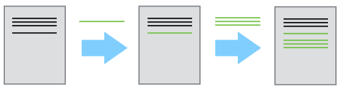
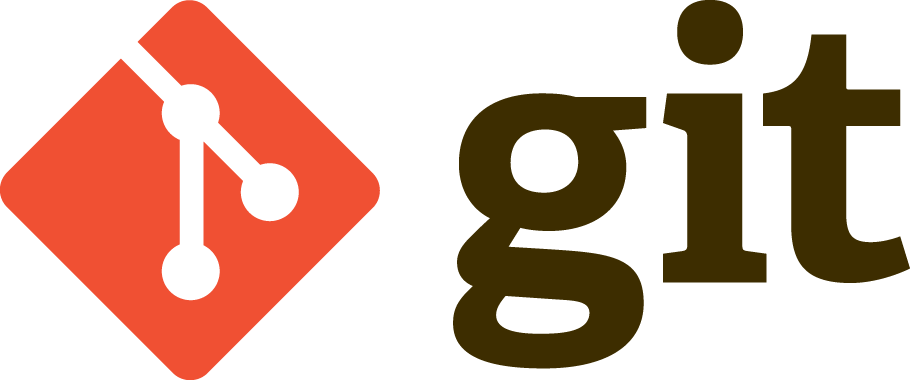

# Introduction to Version Control

## Sources

These materials are inspired and partially based on the Software
Carpentry lesson on [Version Control with
Git](http://swcarpentry.github.io/git-novice/) and the [GitHub Campus
Advisor materials](https://education.github.com/teachers/advisors).

## Familiar?

<figure>

<figcaption>Source: <a
href="https://xkcd.com/1459/">https://xkcd.com/1459/</a></figcaption>
</figure>

<figure>

<figcaption>Source: "Piled Higher and Deeper" by Jorge Cham, <a
href="http://www.phdcomics.com">http://www.phdcomics.com</a></figcaption>
</figure>

::: admonition
Wouldn\'t it be nice to learn how to avoid this situation!?!?

We\'ve all been in this situation before; it seems ridiculous to have
multiple nearly identical versions of the same document. Some word
processors let us deal with this situation to some extent, such as using
Microsoft Word\'s \"Track Changes\" feature, however, it can be quite
impractical if you would like to see modifications that are older than
your previous round of changes.
:::

## What is version control?

[Version control](https://en.wikipedia.org/wiki/Version_control) is used
to track and store changes in your files without losing the history of
your past changes.

Version control systems start with a base version of a document and then
save just the changes you make at each step of the way. You can think of
it as a tape: if you rewind the tape and start at the base document,
then you can play back each change and end up with your latest version.

<figure>

<figcaption>Illustration of committing changes</figcaption>
</figure>

A version control system is a tool that keeps track of these changes for
us and helps us version our files ([and
merge](https://en.wikipedia.org/wiki/Merge_(version_control)) - not
covered in this course). It allows you to decide which changes should be
included the next version, called a commit, and keeps useful metadata
about those changes. The complete history of commits for a particular
project and their metadata make up a repository (such as our [course
material repository](https://github.com/geo-python/site)). Repositories
can be kept in sync across different computers facilitating
collaboration among different people.

**One of the most obvious reasons to use version control is to** avoid
the situation illustrated in the [comics above](#familiar), i.e. to
**track the full history of your changes in a systematic way** without
the need to have multiple versions of the same file. One really useful
feature of version control is the ability to \"go back in time\", i.e.
**if something goes wrong, you can start from some earlier version of
the file when everything was still working**. You can also compare the
differences between versions and see what has changed. In addition to
the aforementioned aspects, version control makes it possible for
multiple people to work on the same file or project at the same time
while still keeping track of their own changes to the files.

There are multiple different Version Control Systems (VCS) (i.e.
software for doing version control) but one of the most popular ones is
[Git](https://en.wikipedia.org/wiki/Git_(software)).

## What is Git?

<figure>

<figcaption>Git Logo by Jason Long, licensed under the <a
href="https://creativecommons.org/licenses/by/3.0/">Creative Commons
Attribution 3.0 Unported License</a>.</figcaption>
</figure>

[Git](https://en.wikipedia.org/wiki/Git_(software)) is a version control
software (developed in 2005 by a rather famous Finn named Linus
Torvalds - he also created Linux!) that is used to track and store
changes in your files (often source code for programs) without losing
the history of past changes. Files in Git are stored in a repository,
which you can simply think of as a directory containing files (or other
directories) related to a single \'project\'. **In practice git takes
\"snapshots\" of your files each time you commit changes** and follows
the idea of [distributed version
control](https://git-scm.com/book/en/v1/Getting-Started-About-Version-Control#Distributed-Version-Control-Systems).
Git is widely used by professionals to keep track of what they\'ve done
and to collaborate with other people. Git is the version control system
that is running behind the scenes and used with GitHub (`Git + Hub`!).

During this lesson, we will learn
`step-by-step how to record changes to our files using Git <git-basics>`{.interpreted-text
role="doc"}.

## What is GitHub?

### Relies on Git

GitHub in principle is a **web based Git repository hosting service**.
Thus it wouldn\'t exist without the version control system Git. Git is
also running all the time in the background when using GitHub.

### Social (collaborative) network

However, GitHub is much more than just a hosting service for Git
repositories as **it is also a social network** where people can
collaborate with each other. It is also easy to invite other GitHub
users to work with the same project. GitHub is a highly popular place
for sharing codes openly to the entire world or alternatively only to
the collaborators working on the same project.

### Open source / science

All publicly available repositories can also be downloaded to your own
local computer where you can start modifying the codes for your own
purpose which is called **\"forking\"**. However, you should always
check and follow the license terms mentioned in the project that
basically tells you what you can do (and what not) with the codes that
are shared. There might be some limitations for commercial use of the
codes for example. **Sharing your work publicly to others is also the
basic principle of open science.**

### Documentation

**GitHub repositories are often also used as web pages for different
projects.** In GitHub such web pages typically include technical
documentation, instructions and examples how to use the codes or
software shared on that page. **It is extremely important that you
document well your codes and programs that you have created** and GitHub
provides a nice platform for doing and sharing such documentation.

Almost every repository (and possibly its subfolders) includes a file
called `README.md` that by default is the front-page of the given
repository in GitHub. Those files are written using a specific simple
language called
[Markdown](https://daringfireball.net/projects/markdown/) that can be
used to create nice looking web pages with different formatting,
figures, tables and so on. Markdown is really easy to use once you have
learned the basic syntax of how different textual elements are written.

### Online tools

There are multiple useful tools integrated into GitHub such as the
possibility to edit the documents or codes directly from the web site.
What is even better is that Git is always running in background also in
the web environment, thus all your changes made in the web browser will
be saved as git commits. It is also possible to browse the whole history
of a file directly from the GitHub\'s online interface and track the
changes that you have made.

Usually Git (the software) is run from the command prompt but GitHub
provides a way to use Git commands without the need to run any commands
in the terminal. There are, however, also other graphical user
interfaces for Git that come with some [Integrated Development
Environments
(IDE)](https://en.wikipedia.org/wiki/Integrated_development_environment).

### Issue tracking

In GitHub it is also possible to give feedback to the developer by
creating a specific \"Issue\" that can be used to report for example a
bug that was found in the code or software. Issues can also be used to
track ideas, enhancements, tasks for projects on GitHub. You can use
Issues also to organize tasks you\'d like to accomplish, such as adding
new features or auditing old ones.

## Basic vocabulary

Here are a few basic terms that are used often when using git and GitHub
(not exhaustive).

-   **Repository** = a location where all the files for a particular
    project are stored, usually abbreviated as \"repo.\" Each project
    will have its own repo, which is usually located on a server and can
    be accessed by a unique URL (a link to GitHub page for example).
-   **Commit** = To commit is to write or merge the changes made in the
    working copy back to the repository. When you commit, you are
    basically taking a \"snapshot\" of your repository at that point in
    time, giving you a checkpoint to which you can reevaluate or restore
    your project to any previous state. The terms \'commit\' or
    \'checkin\' can also be used as nouns to describe the new revision
    that is created as a result of committing.
-   **Revision / version** = A revision or a version is any change in
    made in any form to a document(s).
-   **Clone** = Cloning means creating a repository containing the
    revisions from another repository. This is equivalent to pushing or
    pulling into an empty (newly initialized) repository. As a noun, two
    repositories can be said to be clones if they are kept synchronized,
    and contain the same revisions.
-   **Pull / push** = Copy revisions from one repository to another.
    Pull is initiated by the receiving repository, while push is
    initiated by the source. Fetch is sometimes used as a synonym for
    pull, or to mean a pull followed by an update.
-   **Merge** = A merge or integration is an operation in which two sets
    of changes are applied to a file or set of files.

## Resources

-   [Screencast series in Youtube for learning
    GitHub](https://www.youtube.com/playlist?list=PL4Q4HssKcxYsTuqUUvEHJ8XxOVOHTSmle)
-   [Tutorial on few extra features of GitHub not (most probably)
    covered in this course (e.g. branch, pull-request,
    merge)](https://guides.github.com/activities/hello-world/)
-   [A TechCrunch article about \'What is GitHub
    Anyway?\'](https://techcrunch.com/2012/07/14/what-exactly-is-github-anyway/)
-   [A list of resources for learning Git and
    GitHub](https://help.github.com/articles/good-resources-for-learning-git-and-github/)
