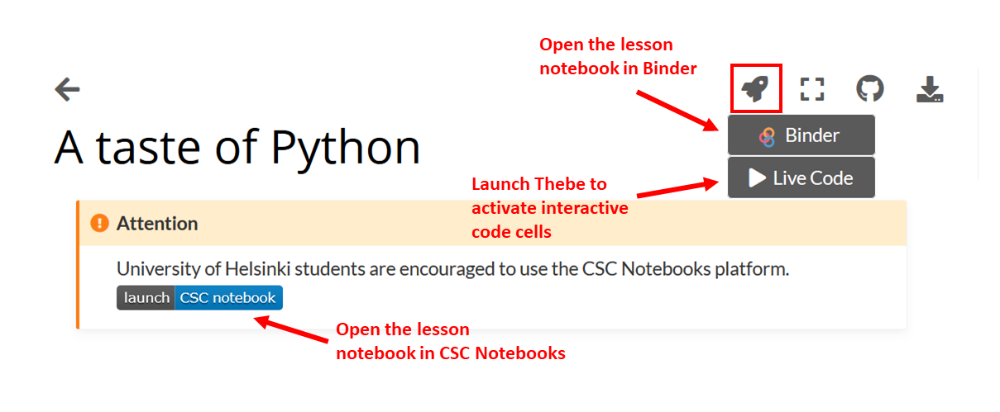
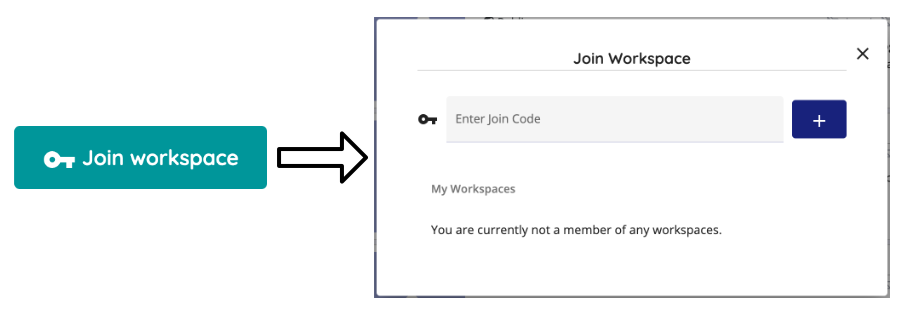
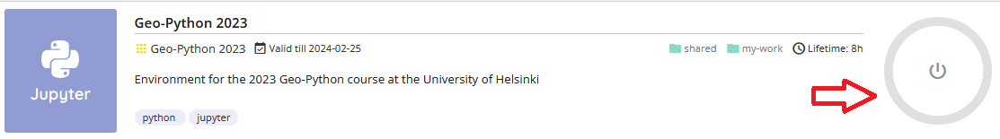
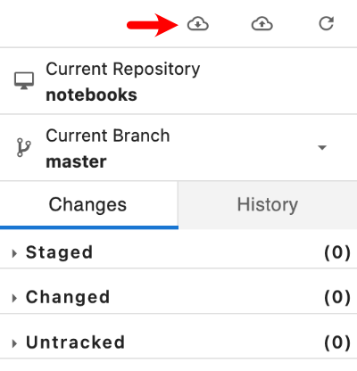

# Course environment

During this course, we will use different tools and applications for
programming and communications:

1.  [Interactive code cells](#interactive-code-cells) for live coding in
    the browser
2.  [JupyterLab](#jupyterlab) for the actual programming
3.  [Cloud computing environments](#cloud-computing-environments) Binder
    or CSC Notebooks
4.  [Git and GitHub](#git-and-github) for version control and
    documentation
5.  [Voting / polling](#voting-and-polling) for interactive questions
    during the lectures
6.  [Discord]() for communicating among UH students

## Interactive code cells

All pages with code cells can be turned into an interactive mode where
you can run the code directly in the browser!

:::: note
::: title
Note
:::

The interactive code cells are a new feature from the 2020 course
materials that is still a bit experimental! Remember, you can always
open up the materials in Binder or CSC Notebooks and run the code in
there.
::::

## JupyterLab

[JupyerLab](https://jupyterlab.readthedocs.io/en/stable/getting_started/overview.html)
is an open-source web-based user interface for doing data science. The
JupyterLab interface consists of different components such as a file
browser, terminal, image viewer, console, text editor, etc.

**Jupyter Notebooks** (filename extension `.ipynb`) are documents inside
the JupyterLab environment which contain computer code, and rich text
elements (figures, links, etc.). Jupyter Notebooks are perfect for
documenting a data science workflow in an interactive format.

**We use JupyterLab/Jupyter Notebooks as the default programming
environment during this course.** All of the course materials are
available in a JupyterLab setting via [cloud computing
environments](#cloud-computing-environments) (Binder or CSC Notebooks).

<figure>

<figcaption>Basic view of JupyterLab</figcaption>
</figure>

<figure>

<figcaption>A Jupyter Notebook open in JupyterLab</figcaption>
</figure>

## Cloud computing environments

We will use cloud-based computing environments (Binder or CSC Notebooks)
to access interactive online version of the lessons and to work on the
weekly exercises. You can use the cloud computing environments with any
computer as long as it has a reasonably fast internet connection and a
web browser (just don\'t use Internet Explorer).

Please note that the cloud computing environments are **temporary**.
Always remember to push your changes to GitHub (and / or download a
local copy).

<figure>

<figcaption>Different options for making the lesson
interactive</figcaption>
</figure>

Each interactive lesson and exercise will have a launch button for both
Binder and CSC Notebook. The CSC notebooks environment is only
accessible to students from Finnish universities and research
institutes.

### Binder

Binder (<https://mybinder.org/>) runs Jupyter Notebooks in your web
browser in a customized environment. The original files (notebooks) are
hosted on GitHub. Binder does not require the user to log in, you can
just click on the link in the lesson / exercise and start working.

<figure>

<figcaption>Binder takes a few moments to load</figcaption>
</figure>

Once the instance is ready, you can navigate to the lesson folders and
start working with existing notebooks or create a new one.

**Remember to save your work! The Binder instance is temporary, and all
your files will be lost after the session.**

### CSC Notebooks

Notebooks by CSC (<https://notebooks.csc.fi>) is a computing environment
hosted by the Finnish IT Center for Science (CSC). Similar to Binder,
the CSC Notebooks platform is used for running Jupyter Notebooks in a
customized environment. CSC Notebooks is available only for students who
are affiliated with Finnish universities and research institutes (via
the Haka user authentication).

:::: note
::: title
Note
:::

**When using the CSC Notebooks for the first time, you need to join the
group created for this course:**

1.  Log in at <https://notebooks.csc.fi/>
2.  Select Haka for the authentication provider
3.  Enter your Finnish university login credentials
4.  Click on the **Join workspace** button on the top left
5.  Join the Geo-Python workspace using the join code `geo-3i9sv41x`

After joining the group, you should be able to view the course
environments called [Geo-Python 2023]{.title-ref} at the top of the
Application list.
::::

<figure>

<figcaption>Launching the instance takes a few moments.</figcaption>
</figure>

:::: note
::: title
Note
:::

**After launching the Geo-Python 2023 workspace the first time:**

1.  Double-click on the `my-work` folder in the file navigator on the
    left side of the Jupyter Lab window
2.  Click on the Git icon on the left side
3.  Click on the **Clone a Repository** button
4.  Enter the address `https://github.com/geo-python/notebooks.git` and
    click **Clone**
5.  You can now access the lesson notebooks in the `my-work/notebooks`
    folder
::::

:::: note
::: title
Note
:::

**Repeat these steps every time when starting to work on a programming
task using the CSC Notebooks:**

1.  Log in at <https://notebooks.csc.fi/>
2.  Select Haka for the authentication provider
3.  Enter your Finnish university login credentials
4.  Click on the **Start session** button for the Geo-Python 2023
    workspace
5.  Navigate to the `my-work/notebooks` directory, click on the Git icon
    on the left and click the **Pull latest changes**
::::

**Remember to save your work!**

## Using your own computer

We recommend everyone to use the available [cloud computing
environments](#cloud-computing-environments) during this course. In case
you want to work on your own computer, you need to [install Python (via
Miniconda)](../../course-info/installing-miniconda.html).

## Git and GitHub

One of the core goals of this course (besides learning programming) is
to learn how to use [version
control](https://en.wikipedia.org/wiki/Version_control) with
[Git](https://en.wikipedia.org/wiki/Git_(software)) and storing your
codes (privately) on [GitHub](https://github.com/).

[Git](https://en.wikipedia.org/wiki/Git_(software)) is a version control
software (developed by a rather famous Finn named Linus Torvalds - he
also created Linux!) that is used to track and store changes in your
files (often source code for programs) without losing the history of
past changes. Files in Git are stored in a repository, which you can
simply think of as a directory containing files (or other directories)
related to a single \'project\'. Git is widely used by professionals to
keep track of what they've done and to collaborate with other people.

[GitHub](https://github.com/) is a web based Git repository hosting
service and social network. It is the largest online storage space of
collaborative works that exists in the world. It is a place where you
can share your code openly to the entire world or alternatively only to
your collaborators working on the same project. GitHub provides a nice
web-interface to your files that is easy to use. It is a nice way for
exploring the codes and documentation or e.g., teaching materials such
as those in our course.

Both Git and GitHub provide many more features than the ones mentioned
here, but for now we are happy to understand the basic idea of what they
are.

## Voting and polling

During the lectures we will ask you questions by using an easy-to-use
polling-system and show you the results in real-time. You can access the
polling system of our course from <https://geo-python.github.io/poll>

:::: note
::: title
Note
:::

The polling system is active only **during** the lessons. If you access
the website outside the lecture times, you will most probably see only a
white page without any content.
::::

Discord \-\-\-\--

During the course we will use actively an application called
[Discord](http://discord.com) for discussion and questions about the
lessons and exercises. All enrolled students have received an invite
link to the [geo-python2023]{.title-ref} workspace at the start of the
course. `Read more about Discord  <discord-usage>`{.interpreted-text
role="doc"}.

## Page summary

Now you should have (at least) a basic idea about the different
components of our course environment and what they mean. You don\'t need
to understand everything fully at this point as they will become clearer
when we start using the course environment.
